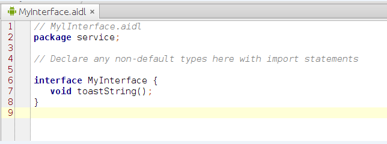
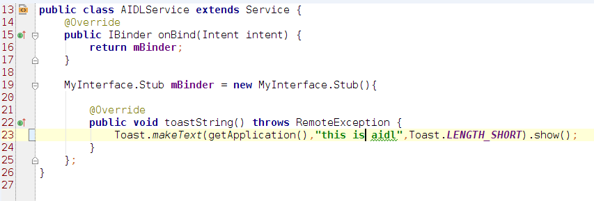
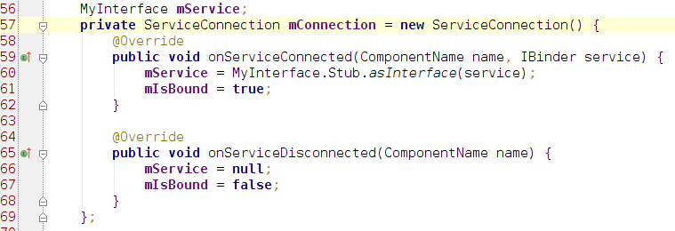
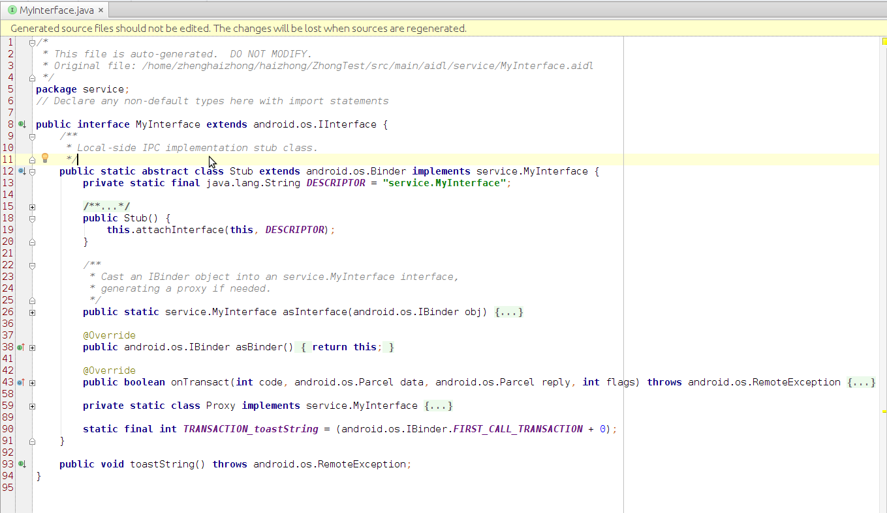

# AIDL摘要学习    
            部分非原创，记录自己的学习
##一.IPC选择
* 只有当你需要来自不同应用的客户端通过IPC（进程间通信）通信来访问你的服务时，并且想在服务里处理多线程的业务，这时就需要使用AIDL。

* 如果你不需要同时对几个应用进程IPC操作，就应该通过实现一个 Binder 创建接口

* 如果您想执行 IPC，但根本不需要处理多线程，使用Messenger来实现接口即可。
_注_: https://developer.android.com/guide/components/aidl.html

## 二.简单使用
### 2.1 创建.aidl文件
 
    下次编译时,在SDK的build-tools中的 aidl工具 会生成对应的.java,如图则会生成**MyInterface.java**,官方称之为**IBinder接口文件**.
这也是android编译打包过程中的其中一步.后面将会详细描述这生成的类 .
_注_:您必须为以上未列出的每个附加类型加入一个 import 语句
****
### 2.2 实现接口
  
    扩展Binder接口(MyInterface.Stub()),mBinder是提供给'客户端'使用的.而这种RPC调用是同步调用,应从'客户端'内的线程来调用AIDL服务.
**** 
### 2.3向客户端公开接口
扩展Service并实现onBind方法,如上面2.2的图所示.
****
至此'服务器'端的代码就OK了
****
### 2.4 客户端调用
  
  
 
 '客户端'bindService后,ServiceConnection会得到2.3公开的接口.
 
 _摘自google的aidl介绍_: 客户端还必须具有对 interface 类的访问权限，因此如果客户端和服务在不同的应用内，则客户端的应用 src/ 目录内必须包含 .aidl 文件（它生成 android.os.Binder 接口 — 为客户端提供对 AIDL 方法的访问权限）的副本。
 
## 三.IBinder接口文件的理解
  
   宏观地去看,其实就是AIDL工具使用.aidl文件生成.java文件的三个任务:
#### 1.定义Java接口
  类名为MyInterface，实现(extends)IInterface接口，IInterface提供一个asBinder()的方法声明，返回值为IBinder。
#### 2.定义Stub
 视为服务器端的代理,重载onTransact方法,提供asInterface(**如果客户端和服务端在同一个进程下，那么asInterface()将返回Stub对象本身，否则返回Stub.Proxy对象(持有远程Binder对象的引用)**,里面还有一些常量值TRANSACTION_xxxxx ,与服务函数对应.
 _注_:当创建一个Binder对象时,服务端内部进程会产生一个,Binder驱动也会产生一个)
#### 3.定义Stub.Proxy
客户端访问服务端(Stub)的代理,从客户端的角度来看,理解为Stub的代理,,持有远程Binder对象的引用
#### ** 交互流程**
Client -> Stub.Proxy(transact) ->Binder驱动(Parcel缓冲区) ->Stub(onTransact) ->Service 
## 四.OneWay
默认情况,客户端会阻塞式地等待服务器执行完毕,如果这时候不需要服务端返回的结果的话,可使用oneway关键字.将aidl接口文件声明为oneway,正因为如此,接口下面的方法必须返回void类型.
