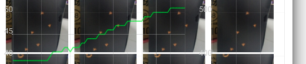

# BitmapFun_InBitmap
 [BitmapFun](https://developer.android.com/topic/performance/graphics/manage-memory.html)  是Google官方的一个图片缓存库,基本上图库缓存库的大体流程都差不多,可以好好研究此源码.但此文主要记录BitmapFun中的InBitmap相关的用法以及自己踩的坑- -..,并非此开源库的分析
 
## 一.用法
inBitmap是Android3.0后引用的方法,平常的LruCache是缓存数据,而inBitmap是回收内存进行复用,减少内存申请分配和回收(减低内存抖动幅度喔).同样的,需要有一个容器,然后进行'Get','Put'....

 _代码与BitmapFun的示例代码相差无几_  
 
### 1.1 "Get"
```java
    public static Bitmap getImageThumbnail(String filePath) {
        BitmapFactory.Options options = new BitmapFactory.Options();
        options.inMutable = true;
        options.inJustDecodeBounds = true;
        BitmapFactory.decodeFile(filePath, options);
        options.inSampleSize = calculateInSampleSize(options, 100, 100);
        Bitmap bitmap = getBitmapFromPool(options);
        options.inBitmap = bitmap;
        options.inJustDecodeBounds = false;
        return BitmapFactory.decodeFile(filePath, options);
    }
```
```java
private static int calculateInSampleSize(
            BitmapFactory.Options options, int reqWidth, int reqHeight) {
        // 原始图片的宽高
        final int height = options.outHeight;
        final int width = options.outWidth;
        int inSampleSize = 1;

        if (height > reqHeight || width > reqWidth) {

            final int halfHeight = height / 2;
            final int halfWidth = width / 2;

            // 在保证解析出的bitmap宽高分别大于目标尺寸宽高的前提下，取可能的inSampleSize的最大值
            while ((halfHeight / inSampleSize) > reqHeight
                    && (halfWidth / inSampleSize) > reqWidth) {
                inSampleSize *= 2;
            }
        }
        return inSampleSize;
    }
```
```java
// This method iterates through the reusable bitmaps, looking for one
    // to use for inBitmap:
    private static Bitmap getBitmapFromPool(BitmapFactory.Options options) {
        Bitmap bitmap = null;

        if (mPool != null && !mPool.isEmpty()) {
            synchronized (mPool) {
                Iterator<WeakReference<Bitmap>> iterator = mPool.iterator();
                Bitmap item;

                while (iterator.hasNext()) {
                    item = iterator.next().get();
                    if (null != item) {
                        // Check to see it the item can be used for inBitmap.
                        if (canUseForInBitmap(item, options) && item.isMutable()) {
                            bitmap = item;
                            // Remove from reusable set so it can't be used again.
                            iterator.remove();
                            break;
                        }
                    } else {
                        // Remove from the set if the reference has been cleared.
                        iterator.remove();
                    }
                }
            }
        }
        return bitmap;
    }
```
```java
private static boolean canUseForInBitmap(
            Bitmap candidate, BitmapFactory.Options targetOptions) {

        if (Build.VERSION.SDK_INT >= Build.VERSION_CODES.KITKAT) {
            // From Android 4.4 (KitKat) onward we can re-use if the byte size of
            // the new bitmap is smaller than the reusable bitmap candidate
            // allocation byte count.
            int width = targetOptions.outWidth / targetOptions.inSampleSize;
            int height = targetOptions.outHeight / targetOptions.inSampleSize;
            int byteCount = width * height * getBytesPerPixel(candidate.getConfig());
            return byteCount <= candidate.getAllocationByteCount();
        }

        // On earlier versions, the dimensions must match exactly and the inSampleSize must be 1
        return candidate.getWidth() == targetOptions.outWidth
                && candidate.getHeight() == targetOptions.outHeight
                && targetOptions.inSampleSize == 1;
    }
```
```java
   /**
     * Return the byte usage per pixel of a bitmap based on its configuration.
     *
     * @param config The bitmap configuration.
     * @return The byte usage per pixel.
     */
    private static int getBytesPerPixel(Bitmap.Config config) {
        if (config == Bitmap.Config.ARGB_8888) {
            return 4;
        } else if (config == Bitmap.Config.RGB_565) {
            return 2;
        } else if (config == Bitmap.Config.ARGB_4444) {
            return 2;
        } else if (config == Bitmap.Config.ALPHA_8) {
            return 1;
        }
        return 1;
    }
```
分析一波:

* 使用injustdecodebounds,不分配内存的去获取原始图片大小,根据要显示的尺寸(_图中是宽高都是100_),计算出最合适的inSampleSize**(_假设inSampleSize=4,decode出来的图片宽高将是原来的1/4,而像素数和内存占用则是原来的1/16,小于1则视为1,一般是2的幂,否则向下舍入到最近的2的幂_.)

* 从容器mPool获取合适Bitmap,如果有的话.

### 1.2 "Put"
 
```java
 public static synchronized void recycle(Bitmap bitmap) {
        if (bitmap == null) return;
        Iterator<WeakReference<Bitmap>> iterator = mPool.iterator();
        while (iterator.hasNext()) {
            Bitmap ref = iterator.next().get();
            if (ref == null) {
                iterator.remove();
            } else if (ref == bitmap) {
                return;
            }
        }
        mPool.add(new WeakReference<>(bitmap));
    }
```
* 源码的'put'只是单纯的add操作,我这里遍历容器移除调被回收的bitmap,而else if与本人踩的坑有关系- -...
* recycle的调用应在内存缓存移除缓存的地方,如LruCache的entryRemoved方法
### 1.3 容器
```java
    private static Set<WeakReference<Bitmap>> mPool = Collections.synchronizedSet(new HashSet<WeakReference<Bitmap>>());
```
* 这里 使用了WeakReference,而源码中是使用SoftReference.
原因是SoftReference拥有强引用的属性,只有当内存吃紧将抛出OOM时,才会被回收.比较适用于LruCache的那种缓存.而WeakReference对内存的使用优于SoftReference

## 二.踩的坑
背景:项目中使用的是Universal-Image-Loader,实现ImageDecoder接口自己去写解析缩略图的代码.没做修改前内存抖动的图(下面的试验均采用相同的测试环境):
 

内存抖动幅度差不多到40M左右.

一开始,我在想Recycle的位置,UIL没暴露LruCache的entryRemoved接口,此时和同事的沟通中提起了Adapter中onViewRecycled.

_onViewRecycled触发时机在item移除到屏幕外时_

实验过程中还涉及到options.inMutable,如下:
onViewRecycled + inMutable = true的情况:
 

内存抖动幅度差不多在7M左右,但是图片错乱了

onViewRecycled + inMutable = false的情况:



内存抖动幅度差不多在12M左右,显示正常. 

总结一波:
      这时候问题来了,为啥这inMutable会导致错乱,如果它为false,inBitmap的用法不生效,那为什么抖动幅度会优化至12M.
      
 * 对于后面的问题,最后发现是动态计算inSampleSize达到优化目的.原来UIL默认的imageDecoder是BaseImageDecoder,里面也有类似的代码,但由于项目背景关系,我们重写了这部分代码,而且没使用inSampleSize去优化.
 
* 对于前面的问题,下面会分析..
* 对于Recycle的位置,由于理解不透彻原因在onViewRecycled调用了从而进坑了
      最终针对UIL,重写其默认的LruMemoryCache,并在其trimToSize方法中添加recycle方法.
```java
                if (maxSize != -1) {
                    xxxx.recycle(value);
                }
```
* 现状
    当LruCache未满时,不会触发inBitmap功效,从测试数据来看,依旧是上述的12M,当我把LruCache的size设置小一点时,如图:
    

 
    内动抖动幅度差不多在10M左右.
 
 综合上面的,体验和性能二者是对立的,例如当你缓存小了,虽然性能好了,但用户体验是图片要重新加载,而不能马上显示..
 
## 三.原理
假设有A,B,C,D,E五张图片,界面每次只能显示一张,依次显示,内存缓存(Cache)的大小为3,回收缓存(Pool)的大小随意

_注:Cache采取先进先出的算法_
###      成功的情况:
* 当显示到C图时,此时的状态是:
UI:C
Cache:A ,B ,C
Pool: 空

* 继续显示D图时,此时的状态是:
UI:D
Cache:B,C,D
Pool : A

* 继续显示E图,假设A的Bitmap符合条件,E将会复用A的Bitmap内存,此时的状态是:
UI:E
Cache:C,D,E
Pool : B

### 踩坑错乱的情况:

* 当显示到B图时,此时的状态是:
UI:B
Cache:A ,B
Pool: A

* 继续显示C图时,此时的状态是:
UI:C
Cache:A,B,C
Pool:B
_注:_ C复用了A的Bitmap内存,此时A的Bitmap是C的数据,这个时候返回去显示A图,就错乱了
