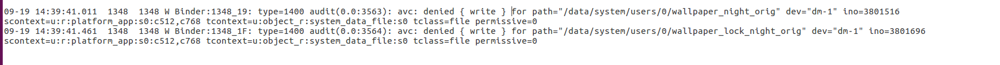
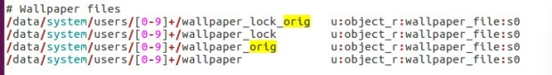

# SELinux  相关
## 一.介绍
`Linux下的一个安全系统，	主要作用就是最大限度地减小系统中服务进程可访问的资源（判断每一类进程是否拥有对某一类资源的访问权限）`  
***
## 二.SELinux 策略语言介绍 (摘抄自网上，用于学习)
### 每个规则都要包含下面五个元素
#### *  规则名称：` allow，dontaudit，auditallow和neverallow`
• allow：表示允许主体对客体执行允许的操作  
• dontaudit：表示不记录违反规则的决策信息，且违反规则不影响运行(允许操作且不记录)  
• auditallow：表示允许操作并记录访问决策信息(允许操作且记录)  
• neverallow： 表示不允许主体对客体执行指定的操作  
#### * 源类型：`授予访问的类型，通常是进程的域类型`  
#### * 目标类型：`客体的类型，它被授权可以访问的类型 ` 
#### * 客体类别：`客体的类别`  
#### * 许可：`表示主体对客体访问时允许的操作类型（也叫做访问向量）`
_例_: allow user_t bin_t : file execute;
这个allow规则的源类型为user_t，目标类型为bin_t，客体类别file，许可execute 。
#### 个人理解为：允许user_t这个进程execute(执行) 类型为bin_t的file(文件)

***
## 三.命令  
__`getenforce` 查询 SELinux 的运行模式__  

__`setenforce 选项`   0： 切换成 permissive（宽容模式）  ； 1： 切换成 enforcing（强制模式）__

***
## 四.个人遇见问题
__4.1 :当时在做着一个界面移植的需求，因此该界面的进程从system_server变成了platform_app，遇到SELinux权限问题，搜索关键字"avc",有如下日志__
`[   68.924146]  (3)[1:init]init: avc:  denied  { set } for property=persist.sys.use.flyme.icon pid=3811 uid=10008 gid=10008 scontext=u:r:platform_app:s0:c512,c768 tcontext=u:object_r:system_prop:s0 tclass=property_service permissive=0`  

__标志性log:__ 
`avc: denied { 操作权限 } for pid=7201 comm=“进程名” scontext=u:r:源类型:s0 tcontext=u:r:目标类型:s0 tclass=访问类型 permissive=0 `

__修复方式:在相应源类型.te 文件，添加如下格式的一行语句：(结尾别忘了分号)   
格式：allow 源类型 目标类型:访问类型 {操作权限}; 即：__  
`allow platform_app system_prop:property_service {set};`
***
__4.2 关于夜间壁纸需求，在壁纸文件的同级目录下新增夜间模式下使用的壁纸文件，遇到的读写问题__
 
 然后我添加了
 `allow platform_app system_data_file:file{ write};
`

结果编译不过：
 `17:15:44 libsepol.report_failure: neverallow on line 1161 of system/sepolicy/public/domain.te (or line 11890 of policy.conf) violated by allow platform_app system_data_file:file { write }; `
`17:15:44 libsepol.report_failure: neverallow on line 458 of system/sepolicy/public/app.te (or line 8821 of policy.conf) violated by allow platform_app system_data_file:file { write };`  
谷歌作了限制不允许这样子操作  

最后，搜索代码发现：
   

即把壁纸文件定义为wallpaper_file类型，而此类型很明显是支持应用进程去读写的。  
__修复方式:__  
`/data/system/users/[0-9]+/wallpaper_lock_night_orig  u:object_r:wallpaper_file:s0`  
`/data/system/users/[0-9]+/wallpaper_night_orig       u:object_r:wallpaper_file:s0`

