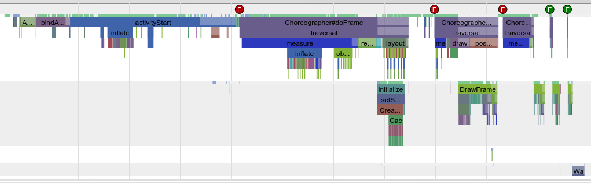
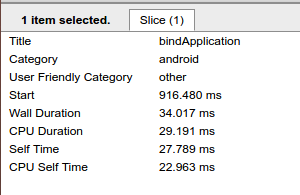
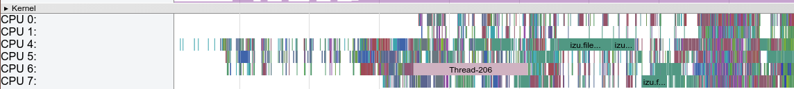
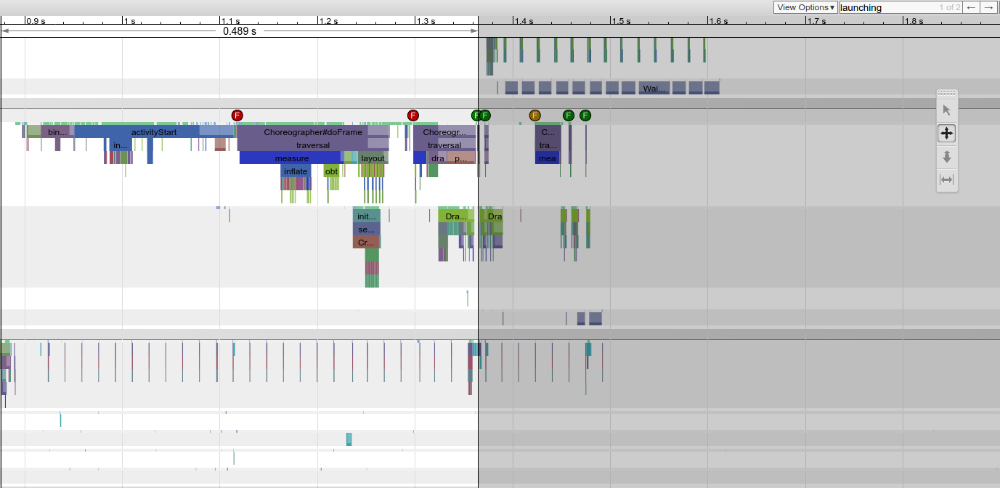

# * Get Systrace File

###   1.cd android-sdk/platform-tools/systrace
###   2.python systrace.py --time=5 -o mynewtrace.trace sched gfx view wm am
注：--time=？为抓取时间，不添加便自己控制。wm为Windowsmanager ，am为Activity Manager，一般应用的分析需添加am：）（刚开始使用时，网上的截图都有bindApplication、ActivityCreate的流程，自己的却没，后来发现是没加这个am）
***
# * Use & Analyze 
## 这里主要分析应用部分:

_注_：Android M(6.0)后，["Better systrace slices for application startup"](https://android.googlesource.com/platform/frameworks/base/+/fbb32f6%5E%21/),添加了多个Systrace输出日志，因此bindApplication前还有3个启动相关的方法:PostFork、RuntimeInit、ActivityThreadMain，暂时还没研究，但可确定的是应用的开发人员对此只能看看：(

### 典型的冷启动systrace图，bindApplication->acitivityCreate->doFrame * N?
### 1.bindApplication相当于应用的Application ，而activityCreate相当于应用的onCreate->onStart->onResume,这里就不累赘了，该优化的都优化吧。
### 2.chrome打开后，w放大，s缩小 ，左键单击能显示该方法的信息,如图：

#### 图中"Wall Duration"这块区域开始到结束的耗时，"CPU Duration"代表这CPU处理这块区域的实际耗时，差值代表着CPU去处理别的了，一般来说大于10ms就得注意了。通过查看CPU，得到具体哪个线程或进程，再配合TraceView去寻找耗时的地方

### 3.m键获取单个方法或配合ctrl+左键来获取某个时间段的情况,这个自己试几次就知道了。
### 4.启动速度 - launching time

#### 步骤: 1.按 "/" 右上角进行搜索 2.输入launching并点下右侧的->箭头 3.按下m 
_注_：其实这测量的是wmAddStarting 到 wmFinishStarting的耗时。

# * Start-up Process(个人的理解)
### 应用的整个启动过程大致分为5?6?个阶段：
#### 1.用户手指点击桌面图标 TouchDown--TouchUp [链接](http://chendongqi.me/2017/02/18/systrace_appLauncher/) 上的down、up参数并没有出现在我抓取的Systrace中，有空研究下Android的Input流程并看看有没有方法得知这段耗时：(
#### 2.Launcher处理Touch事件 ，同上后期有空研究
#### 3.amStartActivity（可搜此关键字）  AMS处理App的启动 
_注：_  why 4 [链接](http://blog.csdn.net/luoshengyang/article/details/8577789)，大概就是Activity组件显示前系统会先显示一个启动窗口
#### 4.Starting Window（启动窗口）的初始化、动画（动画时间、开始大小、透明度等）耗时（关键字：wmaddStarting）
#### 5.App启动 （bindApplication开始...）-- 第一帧绘制完毕（关键字：finish draw第一帧绘制完毕，但不是马上呈现给用户）
_注 :_ 5过程中，如果启动窗口做完动画后，若第一帧未被绘制完成，就会呈现白屏
#### 6.第一帧绘制完毕-调用removeStartingWindow-surfaceflinger送帧显示(关键字：wmFinishStarting，remove的时候，surfaceflinger相关的暂时没研究)  
_注：_ 456需要同时来看 ， 从连贯性来说，启动窗口在Start到被remove期间，App如果绘制完成，这时候就不会有白屏停留。启动窗口理解为icon到全屏，全屏后（remove掉后）如果未绘制完毕就白屏
