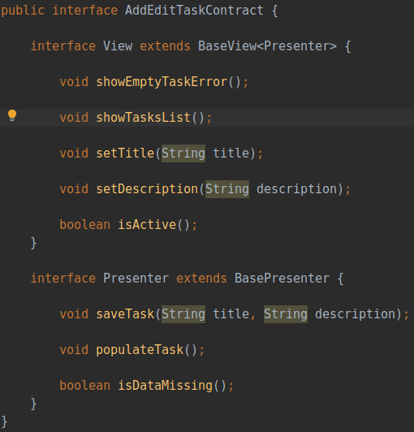

# Google Todo App学习
项目地址： https://github.com/android/architecture-samples
_学习记录官网demo的编程架构和设计思想_
## 项目结构

## 一、Contract
相比于常规的MVP，Demo中每个功能模块都包含xxxContract,此类的作用是更直观地知道V层是如何调用P层，P层是如何回调给V层，了解该模块的功能，举例如图：

 

V层需implements AddEditTaskContract.View
P层需implements AddEditTaskContract.Presenter

## 二、AppExecutors
 
 

Global executor pools for the whole application. ：）

## 三、Clean架构
代码分支切到todo-mvp-clean
```
优点：便于测试维护扩展，代码易读，适合协同开发
缺点：结构复杂，类急剧增加
适合大型复杂的项目
```

#### 3.1 流程图:
 

宏观的去看，这结构是在M层和P层间添加了UserCase这一层，大程度的释放了P层的压力，代码粒度更细了
```
UseCaseHandler:供P层调用，去执行UseCase
UseCaseScheduler：一个线程池的类，提供异步操作
UseCase:抽象类，实体类代表着各种操作,与M层交互，设计者思想这一块是纯Java模块，不包含Android依赖
UseCaseCallback:UseCase获取数据后，返回给P层的接口类

流程总结：V层通过P层传递实体类UserCase到UseCaseHandler中，并通过UseCaseScheduler异步执行UserCase，最后结果通过UseCaseCallback，返回给P层，然后P层再通过接口返回给V层
```
<br/><br/>
#### 3.2 代码逻辑：
##### UserCase.java & UseCaseCallback
 
```
1.抽象类
2.供子类实现的请求参数RequestValues，返回参数ResponseValue
3.RequestValues和UseCaseCallback的get、set方法
4.抽象方法executeUseCase，传入RequestValues，由子类实现具体逻辑

使用泛型+接口，协定使用方法，代码更规范，可读性更强 
```

##### UserCase实现类，举例DeleteTask.java
 
```
1.根据自身Case逻辑重写父类的RequestValues(taskId作为参数)
2.重写executeUseCase，与M层交互，并调用callback返回结果
```	
##### UseCaseScheduler实现类:UseCaseThreadPoolScheduler.java
 
```
1.主要把Runnable任务放在线程池里执行
2. **注1** Handler.post方法能保证返回给P层的结果是运行在UI线程 
```
##### UseCaseHandler.java

```
 * Runs {@link UseCase}s using a {@link UseCaseScheduler}：)
 值得注意的是UiCallbackWrapper方法，将接口UseCaseCallback包装，作用是保证返回给P层的结果是在UI线程
```
  

  *Callback回调流程：*
 
 * 1.当UseCase从M层获取数据后触发getUseCaseCallback().onSuccess(new ResponseValue()); 这里getUseCaseCallback()返回的就是UseCaseHandler.java中execute方法设置UiCallbackWrapper对象
 * 2.UiCallbackWrapper中的onSuccess方法调用的是UseCaseHandler的notifyResponse
 * 3.UseCaseHandler的notifyResponse方法调用的是UseCaseScheduler的notifyResponse 
 * 4.接着就是**注1**那，直接把调用post在UI线程
 
 _其实在UseCase直接post调用也行，但这么绕的原因是为了保持UserCase的整洁<纯java>，不违背clean架构设计思想_

#### 3.3 使用 举例如下：
 	

```
loadStatistics方法就调用UseCaseHandler的execute方法，结果通过mStatisticsView接口返回给V层
```	
