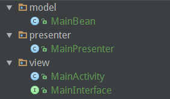
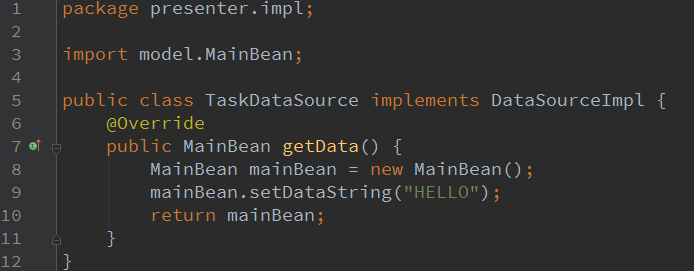
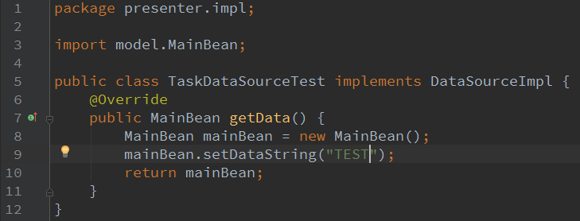
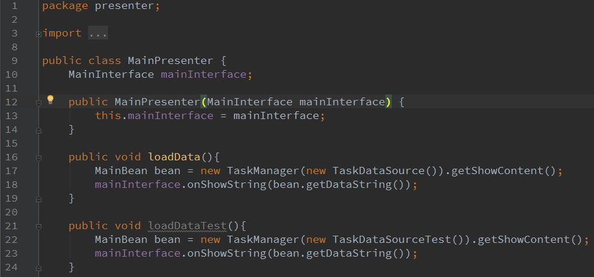
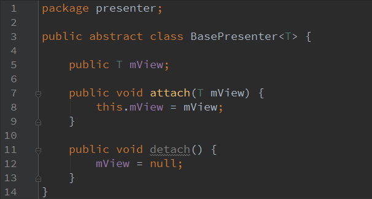
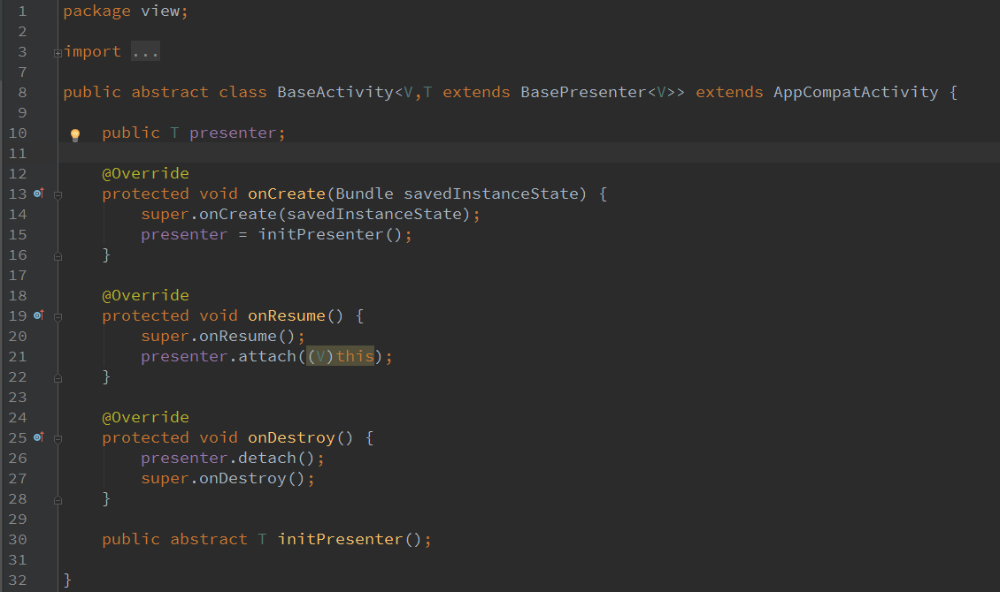

# * 简单使用
### 先看下MVP的模式图:

_注:_ 暂不需理解其逻辑，demo演示完再回来看就明白了，只需要留意其中的元素：
`  M`、`V`、`P`、`ViewInterface`
### Demo 
#### 结构图
> 
#### M(Model)
 >Model，得根据具体的需求来进行设计（废话）。这个demo是一个setText的demo，所以Model的核心如图：
   
  再比如若你是一个登录的需求，那你的model就至少有Username、password的变量，没啥难的，完毕。
#### ViewInterface
>通过上面的模式图可知，这是一个连接V、P的桥梁，它是一个回调接口，P处理得到的数据返回给V：
   
  onShowString传递什么都可以，甚至是步骤一的model。一开始代码onShowString的参数就是传递步骤一的model，在理解上以为V和M打交道了- -!!。总之，这只是一个普通的接口，没啥难的，完毕。
#### (P)Presenter
>接下来，编写P。首先想下P的大概哈，上述步骤二编写的回调接口，由V传给P，所以P要接收，这是第一点。接着，P的设计初衷就是为了抽离V的业务逻辑，
让V没有那么臃肿，并且降低耦合，所以P有个处理业务逻辑的方法，这是第二点。再接口，你特么得提供一个方法给V调用啊。没了：
   
#### (V)View
> V一般的具体实现载体是Activity或者Fragment，直接看图咯:
 
实现接口并传递给P，调用P的方法，然后回调- -!!.没了。

****
 稍微说下优缺点：

 `优点`：
1) 随着需求变得庞大，视图操作和业务逻辑不用都挤在V中，提高可阅读性。`

2) 逻辑抽离到P接口中，因此可以有多种具体的实现，并且方便单元测试，后面会详细介绍

`缺点`：
1) V和P互相持有引用并互相做回调,需求越多回调越多,代码不美观，回调地狱（EventBus、Otto）
2) P会持有V的引用，会有内存泄漏的隐患，后面会详细解决

   V不臃肿了，P就会臃肿，甚至多个P，但没办法，需求多代码肯定上升，但个人觉得谈不上复杂，只是相对MVC多了- -!!学习理解多了点。

后面将有些优化MVP的学习，了解使用下也好啊。

# *P的拓展
这个其实只是运用了Java的特性 继承 或者接口 都行，相对于MVC来说，方便测试以及拓展类似的业务。看图：
 
为了对比之前的图，统一四个新增的类放在了impl包中，而且我觉得这属于P的一部分，就放在了P包下。这里使用了接口DataSourceImpl类：
 
接下来是两种实现类：
 
 
上面没啥说的，两组不同的实现，不同的数据源。

最后一个新增的类TaskManager,只是用来管理各种实现，可有可无，但最好还是要啦
 
接下来是修改后的P：
 
其他都没有改变。

----------------------------------华丽的分割线--------------------------------------

对于这个例子，一个接口两种实现同个管理。TaskManager类的添加在于：

1）上层V，下层Data，上层不需关心数据是如何获取。

2）如果你有不止两种实现呢。易于管理。

3）可对数据拼装交给调用层 。想对所有的实现都加点一样的东西呢。

4）其勾选方法参数是数据层的接口，意味着可传入不同的实现。就上面的两种实现啊.

 第四点，就是你们正式线上时使用实现一loadData(),测试逻辑时使用loadDataTest(),方便单元测试
 
#  *RX的结合
 这部分也是作为拓展，首先将下为啥要引入Rx：
    P层获取数据，不论是从本地或是网络获取，都应在线程中执行主线程渲染。Android本身也提供了许多方法如Thread+Handler、AsyncTask等.

   这里使用Rxjava是简洁，而且这种链式编程可随意增加调用返回，尤其在业务越复杂的时候，体现更明显，虽然可能代码量会多一点点..- -!!   
    
   ----------------------------------华丽的分割线--------------------------------------

别问为啥报错，我举个栗子而已.
#  *内存泄漏的解决
P持有V的引用，在某些情况下就有可能造成内存泄漏。由于P的数量会在项目中很多（简单的项目就不要用MVP啦），所以通过抽象、泛型来达到复用

对比“一、简单使用”的MVP中增加了两个抽象基类 BasePresenter、BaseActivity，图：
  
 这里的mView指的是对Activity的引用,接着是BaseActivity：
 
在onResume时attch,onDestory时detach。上述的initPresenter和此次主题无关，就抽象一下～

最后贴个图，感觉还可以：
    
