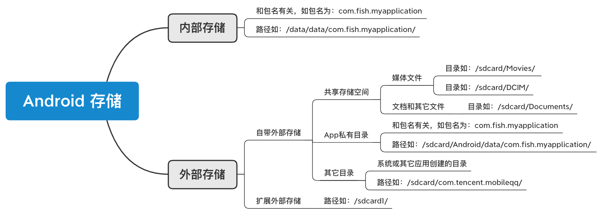

# 存储权限相关
   部分非原创，记录自己的学习
## 一、存储区域划分   
 
 _<图片来源于网上>_
 
#### 1.从内部存储空间访问，可以使用 getFilesDir() 或 getCacheDir() 方法
#### 从外部存储空间访问，可以使用 getExternalFilesDir() 或 getExternalCacheDir() 方法 
#### 2.如果文件存储在内部存储空间中的目录内，即/data/data/app包名下的数据，不能访问
#### 如果文件存储在外部存储空间中的目录内，即/sdcard/Android/data/,可以访问
## 二、访问方式
### Android 6.0（M）之前，只需在AndroidManifest.xml 里声明存储权限
`    <uses-permission android:name="android.permission.WRITE_EXTERNAL_STORAGE" />`
   `<uses-permission android:name="android.permission.READ_EXTERNAL_STORAGE" />`

### Android 6.0(M)之后，还需在代码里动态申请权限
`ContextCompat.checkSelfPermission`  

`ActivityCompat.requestPermissions`

`onRequestPermissionsResult`

### Android 10.0(Q),引入分区存储
`android:requestLegacyExternalStorage="true"来关闭Andorid10的分区存储。`

`不支持file://类型访问文件，只能通过uri方式访问`
### Android 11(R),强制执行分区存储
#### MANAGE_EXTERNAL_STORAGE 权限会授予以下权限：
`使用所有文件访问权限MANAGE_EXTERNAL_STORAGE，代码基本不需要改动。`

`1.对共享存储空间中的所有文件的读写访问权限。注意：/sdcard/Android/media⁠ 目录是共享存储空间的一部分。`

`2.对 MediaStore.Files 表的内容的访问权限。`

`3.对 USB On-The-Go (OTG) 驱动器和 SD 卡的根目录的访问权限`

`4.除 /Android/data/、/sdcard/Android 和 /sdcard/Android 的大多数子目录外，对所有内部存储目录⁠的写入权限。此写入权限包括文件路径访问权限。`

## 三、分区存储
### 1、App访问自身内部存储空间、访问外部存储空间-App私有目录不需要任何权限(这个与Android 10.0之前一致)，即（/data/data/包名）
### 2、外部存储空间-共享存储空间、外部存储空间-其它目录 App无法通过路径直接访问，不能新建、删除、修改目录/文件等（/Android/data/包名）
### 3、外部存储空间-共享存储空间、外部存储空间-其它目录 需要通过Uri访问

